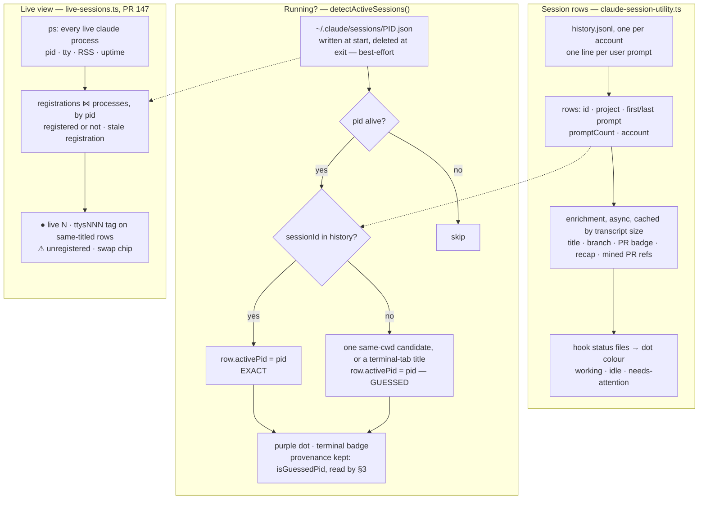
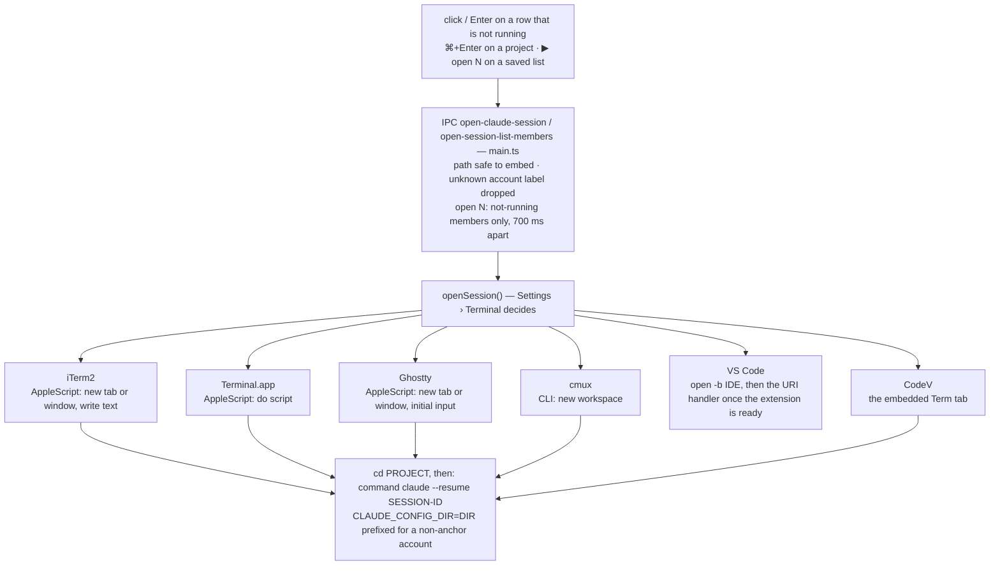
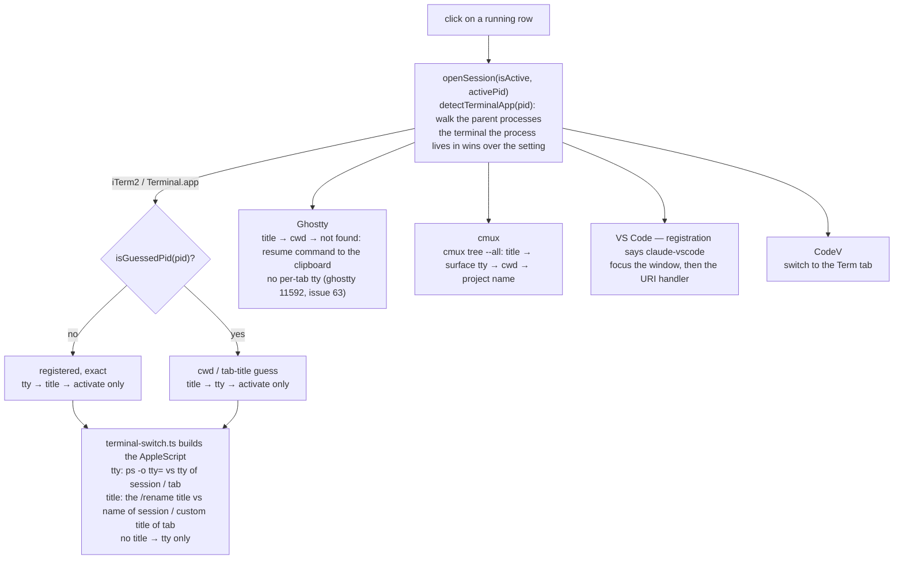

# Claude Code Session List Integration Design

## Goal

Add Claude Code session history to the CodeV Quick Switcher, allowing developers to quickly search, browse, and resume past sessions — just as fast as switching VS Code/Cursor projects.

## Claude Code File Structure

```
~/.claude/
├── history.jsonl                          # Global prompt log (append-only, ~3MB)
├── cache/
│   └── session-metadata.db                # SQLite cache DB (~1.5MB, NOT real-time)
├── projects/
│   ├── -Users-you-git-my-project/         # Encoded project path (all non-alphanumeric except - → -)
│   │   ├── sessions-index.json            # Per-project session index (may not exist)
│   │   ├── abc123.jsonl                   # Full conversation log for session abc123
│   │   ├── abc123/                        # Session subdirectory
│   │   │   └── tool-results/              # Tool output files
│   │   └── memory/                        # Project-level memory files
│   └── -Users-you-git-another/
│       └── ...
├── settings.json                          # User settings
├── session-monitor-titles.json            # c9watch custom titles (if c9watch installed)
└── session-monitor-names.json             # c9watch legacy names (unused)
```

## Data Sources

### 1. `~/.claude/history.jsonl` — Primary (used in MVP)

Global append-only log. A line is appended **every time the user sends a prompt** (not just first/last).

```json
{"display":"Fix the auth bug...","timestamp":1759146405713,"project":"/Users/you/git/my-project","sessionId":"abc-123-def"}
```

| Field | Description |
|-------|-------------|
| `display` | User's prompt text |
| `timestamp` | Unix milliseconds |
| `project` | Original project path |
| `sessionId` | UUID |

Properties:
- **Real-time** (appended on every prompt)
- Single file, ~3MB, fast to read (~40ms in Node.js)
- Requires deduplication (multiple lines per session — one per user prompt)
- No `summary`, `title`, or `custom-title` fields
- **Message count caveat**: CodeV's `messageCount` is the number of `history.jsonl` entries per session (= interactive user prompts only). This is much lower than the actual conversation message count — e.g., a session with 2810 user+assistant messages in the session JSONL may only have ~339 entries in `history.jsonl`. Subagent prompts, tool results, and system messages are not recorded in `history.jsonl`. For accurate message counts, reading the session JSONL (`projects/<path>/<id>.jsonl`) is needed (c9watch does this, counting user+assistant entries).
- `messageCount` can only count user prompts (not assistant responses)

### 2. `~/.claude/projects/{path}/{session-id}.jsonl` — Secondary (used for custom titles)

Full conversation log for a single session. One JSON object per line.

**Entry types:**

| Type | Description |
|------|-------------|
| `user` | User prompt (`message.content` as string or array) |
| `assistant` | Claude's response (`message.content` array with text/tool_use/thinking blocks) |
| `custom-title` | User-defined title via `/title` or `/rename` command |
| `summary` | Conversation summary (from `/compact`) |
| `file-history-snapshot` | Checkpoint data for file edits |
| `progress` | Streaming progress updates |
| `queue-operation` | Internal queue state |
| `system` | System messages |

**The `custom-title` entry (important):**
```json
{"type":"custom-title","customTitle":"my-session-name","sessionId":"abc-123-def"}
```

Key facts about custom titles:
- This is the **only** place Claude Code stores `/title` names — there is no centralized title file
- `history.jsonl` and `sessions-index.json` do NOT contain this field
- Can appear **anywhere** in the file (not just at the beginning)
- A session can be renamed multiple times; each rename appends a new entry
- The **last** `custom-title` entry is the current title
- Empty `customTitle` clears any previous title

**Performance notes:**
- 170 JSONL files, total ~771MB
- Some files are very large (80–108MB for long sessions)
- Grepping 100 files for custom-title takes ~2s (I/O bound)
- Uses `grep '"type":"custom-title"' <file> | tail -1` per file (precise pattern to avoid false positives from assistant messages discussing custom-title)
- Async parallel via `Promise.all`
- Results cached with 5s TTL

### 3. `~/.claude/cache/session-metadata.db` — Not used in MVP

SQLite database with FTS5 index, rich metadata.

**Problem: This is a cache DB that is NOT updated in real-time.** Testing showed data can lag days behind (e.g., DB latest 3/15, actual latest session 3/18).

**Schema — `session_metadata` table:**
```sql
CREATE TABLE session_metadata (
    path TEXT PRIMARY KEY,
    mtime INTEGER NOT NULL,
    project TEXT NOT NULL,
    session_id TEXT NOT NULL,
    first_timestamp TEXT,
    last_timestamp TEXT,
    message_count INTEGER NOT NULL,
    total_tokens INTEGER NOT NULL,
    models_used TEXT NOT NULL,
    has_subagents INTEGER NOT NULL,
    first_user_message TEXT,
    data BLOB NOT NULL                  -- binary blob (format undocumented)
);
```

**Other tables:**

| Table | Purpose |
|-------|---------|
| `activity_cache` | Tool call counts and alert counts per session |
| `activity_alerts` | Alerts by severity/category |
| `aggregate_stats` | Global counters (total_sessions, total_messages), auto-updated via triggers |
| `cache_metadata` | Schema version (currently `6`) |
| `session_fts` | FTS5 virtual table for full-text search on `first_user_message` and `models_used` |

Stats: 852 sessions, 1.5MB, queries ~5ms. Could be used in Phase 2 for enrichment (token stats, model info).

### 4. `~/.claude/projects/{path}/sessions-index.json` — Not used in MVP

Per-project session index. Directory name encoding: all non-alphanumeric characters (except `-`) replaced by `-` (e.g., `/` → `-`, `_` → `-`, `.` → `-`). This encoding is lossy.

```json
{
  "version": 1,
  "entries": [{
    "sessionId": "abc-123-def",
    "fullPath": "/Users/you/.claude/projects/.../abc-123-def.jsonl",
    "fileMtime": 1770028945180,
    "firstPrompt": "Fix the auth bug...",
    "summary": "OAuth token refresh bug fix",
    "messageCount": 42,
    "created": "2026-02-01T10:00:00Z",
    "modified": "2026-02-01T12:30:00Z",
    "gitBranch": "fix/auth-bug",
    "projectPath": "/Users/you/git/my-project",
    "isSidechain": false,
    "prNumber": 42,
    "prUrl": "https://github.com/...",
    "prRepository": "owner/repo"
  }],
  "originalPath": "/Users/you/git/my-project"
}
```

**Problems:**
- **Not guaranteed to exist.** Some projects never get this file despite having many sessions.
- `summary` is AI-generated and not always present.
- `prNumber`/`prUrl`/`prRepository` only present for PR-related sessions.
- Update timing is unclear.

Could supplement with branch name, AI summary, and PR info in Phase 2.

### Data Source Comparison

| | `history.jsonl` | `session-metadata.db` | `projects/*/*.jsonl` | `sessions-index.json` |
|---|---|---|---|---|
| **Real-time** | Yes | No (cache, can lag days) | Yes | Unclear |
| **Speed** | Fast (~40ms, 3MB) | Very fast (~5ms) | Slow (scan dirs, 771MB) | Medium (per-project) |
| **Data richness** | Low (prompt text) | Medium (tokens/models) | High (full conversation) | Medium (branch/summary/PR) |
| **Reliability** | High (append-only) | Medium (may be stale) | High | Low (may be missing) |
| **Used by** | c9watch history, CodeV | — | claude-history | c9watch monitor |
| **Best for** | Session list + search | Stats + enrichment | Full-text search + titles | Branch/PR supplement |

### Data Retention

The "30 days" in Claude Code's data-usage docs refers to **server-side** retention, not local. Local files are **not observed to be auto-deleted** — `history.jsonl` entries persist 5+ months, session JSONL files persist indefinitely. However, Claude Code could introduce local cleanup in a future version.

## Flow at a glance

Three flows, in the order a user meets them: the list is built and told which rows are running (§1); a click on a row that is not running opens it (§2); a click on a running row switches to it (§3). The diagrams show the structure; the bullets under each carry the detail, and the sections further down the history.

**Open or switch — how the click decides.** The row itself says: `isActive` with an `activePid`, set by §1's detection (or by the live report, for a second process on the same session id), means switch; otherwise open. The renderer passes both to `open-claude-session`, `openSession` branches on them — and a running row whose registration says `entrypoint: claude-vscode` takes the VS Code path whatever the terminal setting says.

### 1. The list, and what is running



- **Rows** come from every account's `history.jsonl`; enrichment reads each transcript later (title, branch, PR badge, recap, PR refs mined from the assistant's text) and is persisted in `~/.config/codev/enrichment-cache`. Hook status files (`session-status-hooks.ts`) colour the dot: working (orange pulse), idle (green), needs-attention (blink); a `working` untouched for 10 minutes shows idle (#110).
- **Detection** trusts a registration only when its `sessionId` is in the history (or it is a VS Code registration): that pid is *exact*. Otherwise the pid is attached by a guess — the single same-cwd candidate, or the row whose title matches a terminal tab. With no `sessions/` directory at all (old Claude Code), `ps` supplies the pids: a `--resume <id>` on the command line is exact, an `lsof` cwd match is a guess.
- **The live view** joins the registrations with the process table, so it also shows processes that never registered, registrations whose process is gone, per-process tty / RSS / uptime, and the machine's swap and memory-pressure figures (`sysctl`); the swap chip appears past 8GB or at warn / critical.

### 2. Open — a row that is not running



- The IPC layer refuses a project path that could end a shell or AppleScript string literal, drops an account label no configured account carries, and — for `▶ open N` — resumes only the members that are not running, 700 ms apart, reporting each failure.
- The command is `cd "<project>" && command claude --resume <id>`, prefixed with `CLAUDE_CONFIG_DIR='<dir>'` when the session belongs to a non-anchor account (multi-account, PR #122); `command` skips the shell's `claude` dispatcher. VS Code opens the project (`open -b <ide>`) and fires the extension's URI handler once the IDE lock file says the extension is ready.

### 3. Switch — a row that is running (purple dot)



- `detectTerminalApp` walks the parent processes (up to 20 levels), so a session running in cmux is switched with cmux's logic even when the setting says iTerm2; the setting only decides where a *new* session opens.
- iTerm2 and Terminal.app try both keys when the session has a title, in the order the pid's provenance calls for (see "Switch matching order" under iTerm2 integration for the table and the history); with no title, tty is the only key. Ghostty has no per-tab tty (#63) and falls back from title to cwd, then copies the resume command to the clipboard. cmux reads its own `tree --all` for surface titles and ttys.

## Current Implementation

### Architecture

```
┌─────────────────────────────────────────────────────────┐
│ Renderer (switcher-ui.tsx)                               │
│  ┌─────────────────────────────────────────────────────┐│
│  │ fetchClaudeSessions()                               ││
│  │  1. getClaudeSessions() → show list immediately     ││
│  │  2. detectActiveSessions() → update purple dots      ││
│  │  2b. loadLastAssistantResponses() → blue text       ││
│  │  2c. detectTerminalApps() → terminal badges         ││
│  │  3. loadSessionEnrichment() → titles + branches     ││
│  └─────────────────────────────────────────────────────┘│
└─────────────────────────────────────────────────────────┘
                    ↕ IPC
┌─────────────────────────────────────────────────────────┐
│ Main Process (claude-session-utility.ts)                 │
│  - readClaudeSessions(): parse history.jsonl (cached)   │
│  - detectActiveSessions(): read sessions/ PID files     │
│  - detectTerminalApp(): walk parent process tree       │
│  - loadSessionEnrichment(): titles + branches (cached) │
│  - loadLastAssistantResponses(): tail JSONL (active)   │
│  - openSession(): route to iTerm2/Ghostty/cmux         │
└─────────────────────────────────────────────────────────┘
```

### Non-blocking loading pattern (SWR-like)

1. **Immediate**: Session list from `history.jsonl` (cached, ~0ms warm / ~40ms cold)
2. **Background (~5ms)**: Active session detection via `~/.claude/sessions/` PID files
3. **Background (~0.5s after 2)**: Last assistant responses for active sessions via `tail -n 200` (~19ms/file)
4. **Background (~0.5s after 2)**: Terminal app detection via parent process tree walk
5. **Background (~2s)**: Custom titles + branch names via async parallel grep/tail on 100 JSONL files

All background operations use async `exec` (not `execSync`) to avoid blocking Electron's main thread. Results cached with 5s TTL. Cache is NOT invalidated on window focus (TTL expiry is sufficient).

### Active session detection

**Primary (v1.0.44+):** Read `~/.claude/sessions/<PID>.json` files:

```
Detection Flow:
┌─────────────────────────────────────────────────────────────────────┐
│ 1. Read ~/.claude/sessions/*.json                        (~5ms)    │
│    → PID, sessionId, cwd, entrypoint, name                        │
│    → Verify PID alive (process.kill(pid, 0))                      │
├─────────────────────────────────────────────────────────────────────┤
│ 2. Match sessionId against history.jsonl                           │
│    ├─ Match found → done ✓                         (most cases)   │
│    └─ No match (e.g. after /clear) → cwd fallback                │
│       ├─ 1 same-cwd session → safe match ✓                       │
│       └─ Multiple same-cwd → cross-ref disambiguation            │
├─────────────────────────────────────────────────────────────────────┤
│ 3. Cross-ref (only for same-cwd ambiguity)                        │
│    Runs per-terminal in parallel (Promise.all):                   │
│    ├─ iTerm2: AppleScript TTY+name → match custom titles (~130ms) │
│    ├─ Terminal.app: AppleScript TTY+title → match custom titles   │
│    ├─ cmux: tree --all tty= → match custom titles (~70ms)         │
│    └─ Ghostty/other: cwd fallback (no TTY upstream)               │
├─────────────────────────────────────────────────────────────────────┤
│ 4. Fallback: if sessions/ doesn't exist (old Claude Code)         │
│    → Legacy detection (ps aux + regex + lsof)                     │
└─────────────────────────────────────────────────────────────────────┘
```

**`sessions/` PID file format:**
```json
{"pid":21697,"sessionId":"0a70cf12-...","cwd":"/Users/you/git/project","startedAt":1774773132631,"kind":"interactive","entrypoint":"cli","name":"my-session"}
```

| Field | Description |
|---|---|
| `pid` | Process ID |
| `sessionId` | Runtime session ID (matches history.jsonl except after `/clear`) |
| `cwd` | Working directory |
| `entrypoint` | `cli`, `claude-vscode`, or `claude-desktop` |
| `name` | Session name from `-n` flag (optional) |

**Known behaviors:**
- Files created on session start, deleted on exit. Claude Code runs `concurrentSessionCleanup()` for stale files.
- `/clear` creates a new sessionId in history.jsonl but does NOT update sessions/ file → mismatch until exit+resume.
- All resume methods (`--resume <uuid>`, `-r <uuid>`, `--resume "title"`, `-r "title"`, `-r` picker, `-c`) preserve the original sessionId.
- `/rename` updates `name` field but does not change sessionId.

**Legacy fallback (old Claude Code without `sessions/`):** Uses `ps aux` + regex for `--resume <uuid>`, `lsof` for cwd matching, cross-reference for disambiguation.
- **Known limitation:** Only detects sessions in terminals, not VS Code integrated terminal
- **One-time timing bug observed:** PID-session mapping was briefly incorrect (possibly during `claude -r` picker UI before selection completed). Could not be reproduced. If recurring, a more precise approach is possible: use iTerm2 AppleScript to get all terminal TTYs + names, cross-reference with claude process TTYs to find correct session ID.

### Custom title extraction

`grep '"type":"custom-title"' <file> | tail -1` on each session's JSONL. Must read entire file since title position is unpredictable (user can `/rename` at any point, multiple times). The last occurrence is the current title.

**Important:** Must use precise pattern `'"type":"custom-title"'` instead of just `"custom-title"` — the latter matches assistant messages that discuss custom-title (e.g., tool calls containing the string as text), causing false positives in long sessions.

**Project path encoding:** Claude Code encodes project paths by replacing all non-alphanumeric characters (except `-`) with `-`. E.g., `/Users/you/git/test_codev` → `-Users-you-git-test-codev`. CodeV uses `replace(/[^a-zA-Z0-9-]/g, '-')` to match this encoding.

### iTerm2 integration

| Action | Method |
|--------|--------|
| **Detect** | `ps aux` → extract `--resume <id>` from args, or `lsof` for cwd |
| **Switch** | Three-layer AppleScript matching: (1) TTY match → (2) title fallback → (3) not found (order flipped in PR #152, see below) |
| **Launch (tab)** | AppleScript: `create tab with default profile` + `write text` |
| **Launch (window)** | AppleScript: `create window with default profile` + `write text` |

**Switch matching order follows the pid's provenance (PR #152; `src/terminal-switch.ts`).** Two keys can find the tab, and both are tried — only the order changes (a session with no custom title has only the tty key):
1. **TTY match** — the process's tty against iTerm2 session ttys. A process has exactly one controlling terminal, so this cannot pick a sibling *when the pid is right*; it jumps to the guessed process's tab when the pid was a guess.
2. **Title match** — the `/rename` custom title, `name of s contains "title"`. Unique only when the user kept it so (three `/branch` siblings under 2.1.260 shared one; a session opened twice does too).
3. **Not found** — activates iTerm2 without switching.

| Where the pid came from | Order | Why |
|---|---|---|
| `~/.claude/sessions/<pid>.json` whose `sessionId` is in `history.jsonl` (or a VS Code registration) — *exact* | tty → title | Registration + `ps` join (PR #147) make the pid exact; titles are the non-unique key |
| Attached by a guess: the registration names a session the history does not know (a fresh `claude` with no prompt yet, a `/branch` child before its first prompt, post-`/clear`), so the pid went to the single same-cwd candidate or to the row whose title matched a terminal tab; or old Claude Code with no registrations (`--resume <id>` from `ps`, `lsof` cwd) | title → tty | The pre-#152 order. `868db59` (2026-03-21) put title first because a guessed pid's tty had picked the wrong tab during a `claude -r` picker; with a guess in hand the title, when there is one, is the better bet |

History: title-first was the order from 2026-03-21 to PR #152 because *every* pid was potentially a guess then — the registration file was read (since PR #67) but never validated, so the code could not tell a registered pid from a guessed one. PR #147's `ps` join made that distinction available; PR #152 first flipped the order to tty-first for everything (the `/branch`-sibling case in #142 C0), then narrowed it to exact pids only. `isGuessedPid` in `claude-session-utility.ts` is the classification: whatever the last detection attached outside the two registration paths.

**Where TTY is relied on** (the list to revisit when Ghostty exposes a per-tab tty, #63): the iTerm2 and Terminal.app switch scripts above, `detectTerminalApp` (parent-process walk), the live view's `·ttysNNN` tag for same-titled rows (the tty comes from `live-sessions.ts`, the tag is rendered in `switcher-ui.tsx`; PR #152), and `openSessionInGhostty`, which today has only title → cwd and would gain the same TTY layer.

**Workarounds discovered:**
- `ps -o tty=` output has trailing whitespace → pipe through `tr -d '[:space:]'`
- AppleScript inline `-e '...'` fails with embedded double quotes → write to temp `.scpt` file, execute with `osascript <file>`

### Terminal.app integration

| Action | Method |
|--------|--------|
| **Detect** | Process tree walk → `commLower === 'terminal'` or `commLower.includes('terminal.app')` |
| **Switch** | Two-layer AppleScript matching: (1) TTY match → (2) title fallback (PR #152) |
| **Launch (tab)** | AppleScript: `do script "cmd" in front window` |
| **Launch (window)** | AppleScript: `do script "cmd"` (standalone) |

**Key differences from iTerm2:**
- Structure is `window → tab` (no session layer). Properties: `tty of tab`, `custom title of tab`.
- Uses `do script` (not `write text`) for command execution.
- `do script in front window` creates a new tab; `do script` without target creates a new window.
- Cross-reference uses same TTY + title pattern as iTerm2.

## UI Design

### Mode switching

Header with toggle buttons + `Tab` key:
```
🤖 CodeV Quick Switcher  [Projects] [Sessions]  [Settings]
```

`Tab` is intercepted in react-select's `onKeyDown` (Projects mode) to prevent default behavior and switch to Sessions mode.

### Session item layout (1.5–3 lines)

```
● project-name · "custom title" [branch-name]     ITERM2  N msgs  Xm ago
  first prompt text  →  last user prompt
  ◀ last assistant response (active sessions only)
```

- Purple dot (`#CE93D8`): active session (14px fixed-width container for alignment)
- Project name: bold white
- Custom title: green (`#7ec87e`), in quotes
- Branch name: grey italic (`#888`), in brackets, `[HEAD]` filtered out
- Terminal badge: small uppercase bordered text (ITERM2, TERMINAL, CMUX, GHOSTTY)
- First prompt: grey (`#999`)
- Last user prompt: amber (`#c89030`)
- Last assistant response: blue (`#64B5F6`), only for active sessions
- Right side: message count + relative time
- Selection: left cyan border (no background overlay), initial state unselected (-1)

Line 2 only shown if prompts exist. Line 3 only shown for active sessions with assistant response.

### Session display modes (Settings)

| Mode | Shows |
|------|-------|
| First Prompt (default) | First user message (grey) |
| Last Prompt | Last user message (amber) |
| First + Last | First (grey) → Last (amber) |

**Note:** "Last prompt" is last **user** prompt from `history.jsonl`, not assistant response. Getting assistant's last response requires reading full session JSONL — may need Rust native module.

### Search

Multi-word AND search runs **locally in renderer** (not IPC) to include all displayed fields: `projectName + project path + firstUserMessage + lastUserMessage + customTitle + branch + assistantResponse`. Search highlight via `react-highlight-words` with color-coded styles matching each field type.

## Keyboard Shortcuts

| Key | Action |
|-----|--------|
| `⌘⌃R` | Open Quick Switcher |
| `Tab` | Toggle Projects / Sessions |
| `↑` / `↓` | Navigate session list |
| `Page Up` / `Page Down` | Jump 5 items |
| `Enter` | Open/resume selected session |
| `Esc` | Clear search, or hide window |

## Settings

In the Settings popup:

| Setting | Options | Default | Storage |
|---------|---------|---------|---------|
| Default Tab | Projects / Sessions | Projects | `electron-settings` |
| Launch Terminal | iTerm2 / Ghostty / cmux | iTerm2 | `electron-settings` |
| Launch Mode | New Tab / New Window | New Tab | `electron-settings` |
| Session Preview | First User Prompt / Last User Prompt / First + Last | First User Prompt | `electron-settings` |

Session-related settings are only visible when in Sessions mode (fixes popup interaction issue #54).

## Terminal Support Matrix

| Terminal | Detect | Switch | Launch | External Access |
|----------|--------|--------|--------|----------------|
| iTerm2 ✅ | `ps` + `lsof` + tty | Title match → TTY fallback | AppleScript: new tab/window + execute | No restriction |
| Ghostty ✅ | `ps` + parent tree | Title match → cwd fallback | AppleScript: `new tab`/`new window` with `surface configuration` | No restriction |
| cmux ✅ | `ps` + `lsof` | Title match → cwd fallback → project name fallback (surface-level) | `cmux new-workspace --cwd --command` | Requires socket `automation`/`allowAll` |
| Terminal.app ✅ | `ps` + tty | Title match → TTY fallback | AppleScript: new tab/window + execute | No restriction |
| Custom | — | — | User command template / clipboard | — |

### Same-CWD Session Matching

When multiple sessions share the same project path, there are two separate concerns: **detection** (purple dot on correct item) and **switch** (jumping to correct tab).

#### Detection layer (purple dot)

**With `~/.claude/sessions/` (v1.0.44+):**

| Launch command | Detection | Same-cwd accuracy |
|---|---|---|
| Any command | `sessions/` → direct PID→sessionId | ✓ (if sessionId in history.jsonl) |
| After `/clear` (before exit) | sessionId mismatch → cwd fallback | 1 same-cwd: ✓; multiple: needs cross-ref |
| Same-cwd + cross-ref (iTerm2) | TTY match via AppleScript | ✓ (with `/rename`) |
| Same-cwd + cross-ref (cmux) | TTY match via tree --all | ✓ (with `/rename`) |
| Same-cwd + cross-ref (Ghostty) | No TTY → cwd fallback | May be wrong |
| VS Code / Claude Desktop | `entrypoint` field | ✓ (new capability) |

**Legacy (without `sessions/`):**

| Launch command | Detection method | Terminals |
|---|---|---|
| `--resume <uuid>` / `-r <uuid>` | UUID from process args | All |
| `-n "name"` / `--resume "title"` | Match against custom titles | All |
| `claude -r` (picker) / bare `claude` | cwd fallback + cross-ref | iTerm2/cmux (with `/rename`) |

Cross-reference: match PID TTY against terminal tab TTYs (iTerm2: `tty of session` AppleScript; Terminal.app: `tty of tab` AppleScript; cmux: `tree --all` tty= field), then match tab name against custom titles. Requires `/rename`. Ghostty pending upstream TTY ([#11592](https://github.com/ghostty-org/ghostty/issues/11592)).

#### Switch layer (click → jump to correct tab)

| Launch command | Has custom title? | iTerm2 / Terminal.app | Ghostty / cmux |
|----------------|-------------------|----------------------|----------------|
| Any with `/rename` | Yes | Title match ✓ | Title match ✓ |
| `claude -n "name"` | Yes (`-n` sets title) | Title match ✓ | Title match ✓ |
| `claude -r "title"` | Yes (resume by title) | Title match ✓ | Title match ✓ |
| `-r <uuid>` without `/rename` | No | **TTY match ✓** (detection correct → correct PID) | cwd fallback ✗ |
| `claude` or `claude -r` (picker), later `/rename`'d + exited + resumed | Yes | Title match ✓ | Title match ✓ |
| `claude` or `claude -r` (picker), `/rename`'d but not yet exited | Yes (but detection wrong without cross-ref) | Cross-reference fixes detection ✓ → Title match ✓ | Detection wrong → may click wrong item |
| `claude` or `claude -r` (picker), never `/rename`'d | No | **Unsolvable** | cwd fallback ✗ |

**Key difference**: iTerm2 and Terminal.app have TTY matching — first when the pid is exact, as the fallback when it was guessed (see "Switch matching order" under iTerm2 integration) — so when detection has the correct PID they can switch correctly even without a custom title (e.g., `claude -r <uuid>` without `/rename`). Ghostty lacks per-tab TTY, so without a custom title + same cwd, it falls back to cwd matching which may switch to the wrong tab. cmux also lacks native TTY in AppleScript, but compensates via its `tree --all` CLI which exposes per-surface TTY for cross-reference.

**Detection with `sessions/` (v1.0.44+)**: Most cases are resolved by direct sessionId matching against history.jsonl. Cross-reference only needed after `/clear` (sessionId mismatch) with multiple same-cwd sessions — a rare combination. The "unsolvable" case (no `/rename` + same cwd) is now limited to cross-reference fallback scenarios, not the primary detection path.

**Cross-reference cascade effect** (iTerm2 + cmux): when cross-reference correctly claims a `/rename`'d session, the remaining same-cwd candidates shrink. If only one un-`/rename`'d session remains, cwd matching has a single candidate and becomes correct by elimination.

- **Recommendation**: Always use `/rename` in Claude Code, or `claude -n "name"` when starting new sessions

### Auto-Detection of Terminal App

For active sessions, CodeV walks the parent process tree (`ps -o comm=` → `ps -o ppid=`, up to 20 levels) to detect which terminal the claude process is running in. This means:
- Clicking an iTerm2 session uses iTerm2 switch logic (even if settings say cmux)
- Clicking a cmux session uses cmux switch logic (even if settings say iTerm2)
- Settings terminal only affects **launching** non-active sessions
- Active sessions show a small uppercase badge (ITERM2, CMUX, GHOSTTY) in the UI

### cmux Integration Details

**CLI commands available:**
- `cmux new-workspace --cwd <path> --command "claude --resume <id>"` — create new workspace with command
- `cmux select-workspace --workspace <id>` — switch to workspace
- `cmux focus-panel --panel surface:N` — switch to specific tab within workspace
- `cmux send "text"` / `cmux send-key enter` — send text/keys to focused terminal
- `cmux list-workspaces [--json]` / `cmux list-pane-surfaces --pane pane:N` — inspect topology

**Socket access restriction:**
cmux CLI communicates via Unix socket (`/tmp/cmux.sock`). By default, only processes started inside cmux can connect (`cmuxOnly` mode). External apps like CodeV need the user to change the socket mode:

| Mode | Access | How to enable |
|------|--------|---------------|
| `cmuxOnly` (default) | cmux child processes only | Default |
| `automation` | Automation-friendly access | cmux Settings UI |
| `allowAll` | Any local process | `CMUX_SOCKET_MODE=allowAll` or Settings UI |
| `password` | Password-authenticated | Settings UI |
| `off` | Disabled | Settings UI |

**Recommended:** Ask user to set `automation` or `allowAll` mode in cmux Settings. Security impact is minimal — only local processes on the same machine can connect.

**Switch strategy for cmux (two-layer, surface-level):**
1. Single `cmux tree --all` call → parse workspace→surface structure
2. **Layer 1 — Title match**: match `/rename` custom title against surface titles in tree output
3. **Layer 2 — CWD fallback**: parallel `sidebar-state` queries for cwd/focused_cwd, then project name match in surface titles
4. Switch: `select-workspace` first (must be active), then `focus-panel --panel surface:N` to switch tab
5. If socket access denied: fallback to clipboard

**Key discovery:** `focus-panel` silently no-ops on non-active workspaces — must `select-workspace` first to make the workspace active, then `focus-panel` to switch the tab within it.

**Launch strategy for cmux:**
1. Try `cmux new-workspace --cwd <project> --command "claude --resume <id>"`
2. If socket access denied: activate cmux + copy command to clipboard

### Ghostty Integration Details

Ghostty has full AppleScript support via `Ghostty.sdef`:

**AppleScript capabilities:**
- `terminal.working directory` — per-terminal cwd (for switch matching)
- `focus` — focus a specific terminal, bringing its window to front
- `select tab` — select a tab in its window
- `new tab` / `new window` — create with optional `surface configuration`
- `surface configuration` — record type with `command`, `initial working directory`, `initial input`, `wait after command`, `environment variables`
- `input text` — send text to a terminal as if pasted
- `send key` — send keyboard events

**Switch (two-layer):**
1. **Title match** — if session has `/rename` title, match against `name of terminal contains "title"` (most precise)
2. **cwd fallback** — match `working directory of terminal is projectPath`

**Launch:** `new tab`/`new window` with `surface configuration from {initial working directory, initial input:"claude --resume <id>\n"}`. Uses `initial input` (not `command`) because `command` is passed directly to `exec` without shell interpretation.

**Note:** Ghostty CLI `+new-window` is not supported on macOS, but AppleScript `new window` works. The `.sdef` is similar to cmux's, but Ghostty's AppleScript actually works (cmux's `count windows` returns 0 — fix submitted as cmux PR #1826).

**Same-cwd limitation:** Without `/rename`, same-cwd sessions may switch to wrong tab. Ghostty does not expose per-terminal PID or TTY in AppleScript — upstream issues [#11592](https://github.com/ghostty-org/ghostty/issues/11592), [#10756](https://github.com/ghostty-org/ghostty/issues/10756), and PR [#11354](https://github.com/ghostty-org/ghostty/pull/11354) track adding this.

### Branch Name: Why Not `git branch --show-current`

`git branch --show-current` returns the repo's **current** branch, but a session may have been created on a different branch that has since been switched away. The JSONL `gitBranch` field preserves the branch at the time of each session entry, which is the correct value to display.

## Phase Plan

### Phase 1 (MVP) — ✅ Implemented

- Session list from `history.jsonl` sorted by last activity
- Multi-word AND search (local, includes all displayed fields)
- `Tab` key to toggle Projects / Sessions, `PageUp`/`PageDown` jump 5
- Active session detection (purple dot) with `claimedSessionIds` dedup
- Auto-detect terminal app (iTerm2/Ghostty/cmux) via parent process tree walk
- Terminal badge (ITERM2, CMUX, GHOSTTY) on active sessions
- Custom title display via async grep with precise pattern
- Git branch name via `tail -n 5`
- Last assistant response for active sessions via `tail -n 200`
- Open/resume in iTerm2, Ghostty, or cmux
- iTerm2: three-layer switch (title → TTY → fallback)
- Ghostty: two-layer switch (title → cwd fallback)
- cmux: two-layer switch (title → cwd fallback, surface-level)
- Default Tab, Launch Terminal, Launch Mode, Session Preview settings
- 1.5-3 line layout with color-coded elements
- Non-blocking SWR loading with stable active state via `useRef`
- CHANGELOG.md with CI auto-read for release notes

### Phase 2 (Planned)

- Full-text search across conversation content (may need Rust native module)
- Bookmark functionality
- Copy resume command (right-click or long-press)
- Session status (Working/Idle) detection from JSONL
- Notifications on Working → Idle transition
- PR info display from `sessions-index.json`
- Terminal.app support
- Collapse/expand for full session details

### Phase 3 (Future)

- Session preview panel (conversation summary)
- Cost/token statistics from `session-metadata.db`
- Custom terminal command template
- Per-terminal PID/TTY matching (pending upstream: Ghostty #11592, cmux #1826)

## Technical Decisions

### TypeScript vs Rust

TypeScript is sufficient for MVP. `history.jsonl` reading (~40ms) and session list rendering are fast. Custom title grep is I/O bound — Rust wouldn't help significantly.

**Rust native module justified for:** full JSONL parsing (last assistant response, full-text search across 771MB), where the 5-10x speedup matters. claude-history achieves <1s for 170 files using Rust + rayon parallel.

### `history.jsonl` vs `session-metadata.db`

`session-metadata.db` has richer data but is a stale cache. `history.jsonl` is always up to date. Same approach used by c9watch's history page.

### VS Code Claude Code sessions — data gap

VS Code sessions (`entrypoint: "claude-vscode"`) have a fundamental data gap:

| State | Detectable? | How |
|---|---|---|
| **Active** | ✓ | `sessions/<PID>.json` with `entrypoint: "claude-vscode"` |
| **Closed** | ❌ | Not in `history.jsonl` ([#24579](https://github.com/anthropics/claude-code/issues/24579)), PID file deleted on exit, session JSONL has no entrypoint field |

c9watch has the same limitation — its history list also reads `history.jsonl` and cannot show closed VS Code sessions. c9watch's deep search scans all `projects/*/*.jsonl` files (multi-threaded Rust), but that is a full-text search feature, not a session list. Neither CodeV nor c9watch uses `session-metadata.db`.

To show closed VS Code sessions, one approach is to find sessions present in JSONL files but absent from `history.jsonl` — these are likely VS Code sessions. However, this requires scanning all JSONL files (~170 files, ~771MB total).

Current fix (PR #78): skip non-cli sessions in `detectActiveSessions()` to prevent false purple dots on terminal sessions.

### grep vs full JSONL parsing for custom titles

`grep '"type":"custom-title"' <file> | tail -1` avoids parsing multi-MB JSON files. Must use precise pattern (not just `"custom-title"`) to avoid false positives from assistant messages. Async parallel `exec` keeps it non-blocking. ~2s for 100 files (I/O bound on 771MB total).

**Future optimization options:**
- Rust native module for parallel scanning
- mtime-based cache invalidation (only re-grep changed files)
- Build persistent custom title index file

## References

- [c9watch](https://github.com/minchenlee/c9watch) — Session monitoring + history search (Tauri/Rust/Svelte)
- [claude-history](https://github.com/raine/claude-history) — Rust TUI for session browsing, full-text search, resume/fork
- [Session Data Sources wiki](https://github.com/grimmerk/c9watch/wiki/Session-Data-Sources-and-Architecture) — Comprehensive research on Claude Code's data files
- [cpark design](cpark-design.md) — Session bookmark/parking concept (not yet implemented)

### Upstream PRs/Issues

| Repo | Item | Title | Status | Impact on CodeV |
|------|------|-------|--------|----------------|
| manaflow-ai/cmux | PR #1826 | Fix AppleScript `count windows` + `working directory` | Our PR, Open | Enables AppleScript for cmux (unified approach) |
| manaflow-ai/cmux | PR #1287 | Add per-surface cwd to API | Open | Alternative to AppleScript for 2nd-tab matching |
| ghostty-org/ghostty | Issue #11592 | Add pid/tty to AppleScript terminal class | Open | Would fix same-cwd switching |
| ghostty-org/ghostty | PR #11354 | Expose PID/TTY on TerminalEntity | Open | Implementation in progress |
| ghostty-org/ghostty | Issue #10756 | Expose TTY/PID in App Shortcuts | Open | Related request |
